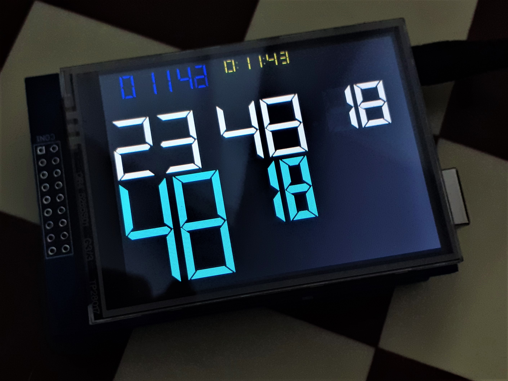

# TFT Virtual Segment Display for Arduino
TFT LCD Virtual Segment Display Library for Arduino 

This library allows to display different virtual segment displays on a TFT LCD using Adafruit TFTLCD Library https://github.com/adafruit/TFTLCD-Library
